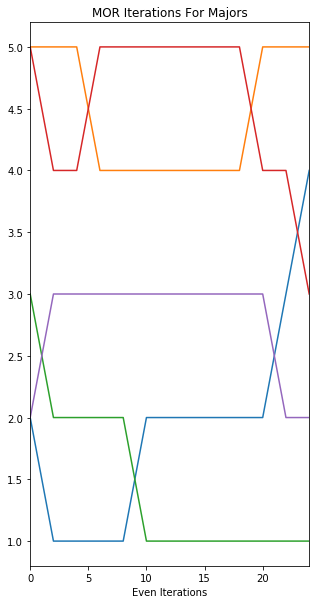

# Economic Complexity Index (ECI)
The ECI package allows you to compute the economic complexity index for any bi-partite network configuration.  This code was used in the project: **Li, Linde and Shimao, 2019, *Major Complexity Index and College Skill Production*, Mimeo.**  If you use this package we ask that you please cite the above work. 


## Usage example

Suppose you have an adjacency matrix linking the number of students from a given major (rows) that end up in a particular occupation (columns) as seen below.  Here, for example, we see that there were a total of 10 students with Mathematics as their major--5 of these ended up working as a Theorist, 3 as Accountants, while 1 became a Journalist and 1 went into a service occupation. 

|Major \ Occupation| Occ1:Theorist| Occ2:Accountant| Occ3:Journalist| Occ4:Service |
|--------------------|:----------:|:--------------:|:--------------:|:------------:|
|Major 1: Mathematics|     5      |        3       |         1      |      1       |
|Major 2: Accounting |     0      |        10      |         0      |      0       |   
|Major 3: English    |     0      |        0       |         8      |      2       |   
|Major 4: Arts       |     0      |        0       |         0      |      10      |
|Major 5: Economics  |     1      |        2       |         2      |      5       | 

The ECI package takes adjacency matrices like this and uses it to calculate the ECI on both the major and the occupation sides. It works both in cases where we want to estimate the weighted ECI or the unweighted ECI (using a simple binary adjacency matrix).  

Looking at the case where we want a ***binary input matrix*** we can use the following Python code:

```python
iterations = 8
AdjData = np.array([[ 5,  3,  1,  1],[ 0, 10,  0,  0],[ 0,  0,  8,  2],[ 0,  0,  0, 10],[ 1,  2,  2,  5]],dtype='f')
[ECI_Maj_All, ECI_Occ_All] = ECI.eci_compute((AdjData>0)*1,iterations)
```
Calling the `ECI.eci_compute(.)` function yields the following output in this case: 

```
-------------------------------------------------------------------------------------------
- **Computation Completed Successfully**                             -
-------------------------------------------------------------------------------------------
Number of Majors,                           M :               5
Number of Occupations,                      N :               4
Number of Iterations used for even,      Iter :               8
Number of Iterations used for odd,       Iter :               7
-------------------------------------------------------------------------------------------
- **Main Results**                              -
-------------------------------------------------------------------------------------------
-------------------------------------------------------------------------------------------
ECI Maj ALL: 
     0    1         2    ...            6         7         8
0  4.0  3.0  3.270833    ...     3.169633  3.164243  3.167402
1  1.0  3.0  3.000000    ...     3.181713  3.135995  3.173659
2  2.0  3.5  3.041667    ...     3.157263  3.181062  3.163158
3  1.0  4.0  2.750000    ...     3.146701  3.187934  3.160807
4  4.0  3.0  3.270833    ...     3.169633  3.164243  3.167402

[5 rows x 9 columns]
-------------------------------------------------------------------------------------------
ECI Occ ALL: 
     0         1         2    ...            6         7         8
0  2.0  4.000000  3.000000    ...     3.158854  3.169633  3.164243
1  3.0  3.000000  3.000000    ...     3.135995  3.173659  3.154827
2  3.0  3.333333  3.166667    ...     3.174190  3.165509  3.169850
3  4.0  2.750000  3.375000    ...     3.187934  3.160807  3.174371

[4 rows x 9 columns]
-------------------------------------------------------------------------------------------
```

Next, we can get the ECI rankings for the majors and occupations using the `ECI.post_analysis(.)` function:

```Python
[ECI_Maj_Even_rank, ECI_Occ_Odd_rank] = ECI.post_analysis(ECI_Maj_All,ECI_Occ_All,['Math','Account','Eng','Arts','Econ'],['Theorist','Accountant','Journalist','Service'])
```

|	| iter0  | iter2   |iter4	  | iter6|	iter8|
|----|:----:|:----:|:----:|:----:|:----:|
|Math|2	|2	|2|	3	|3|
|Account|5|4	|3	|1	|1|
|Eng	|3	|3	|4	|4	|4|
|Arts|5	|5	|5	|5|	5|
|Econ|2|	2	|2	|3	|3|


And we can also plot how these ECI rankings evolve over the iterations using the `MOR_Plot(.)` function:
```Python
ECI.MOR_plot(ECI_Maj_Even_rank,'MOR Iterations For Majors','Even Iterations')
```



## License

This project is licensed under the MIT License - see the [LICENSE](LICENSE) file for details

## Acknowledgments
The economic complexity index was first put forth in the context of country-trade data by Hidalgo and Hausmann (2009). See their work:
Hidalgo and Hausmann, 2009, *The building blocks of economic complexity*, Proceedings of the National Academy of Sciences Jun 2009, 106 (26) 10570-10575; DOI: 10.1073/pnas.0900943106
